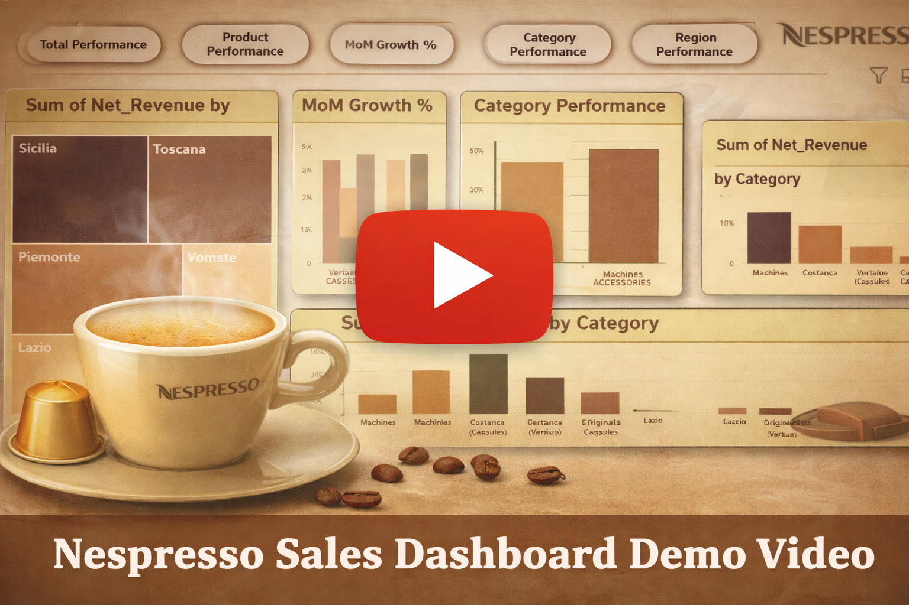
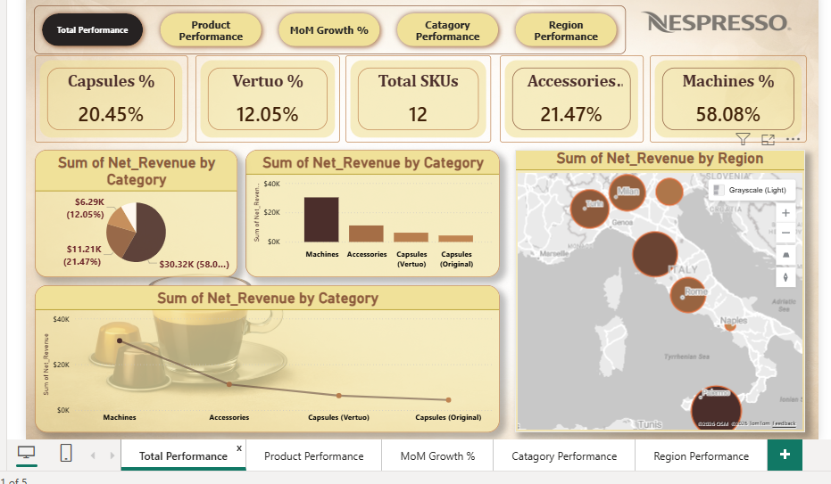
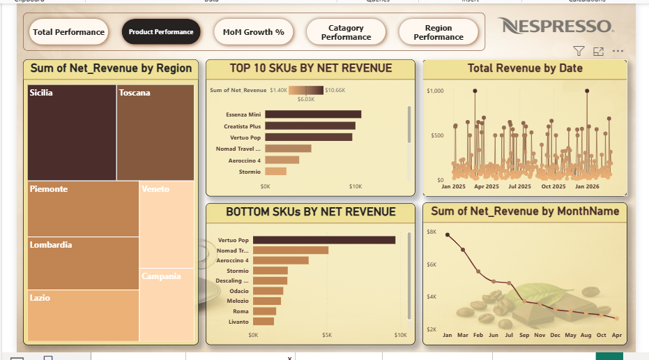
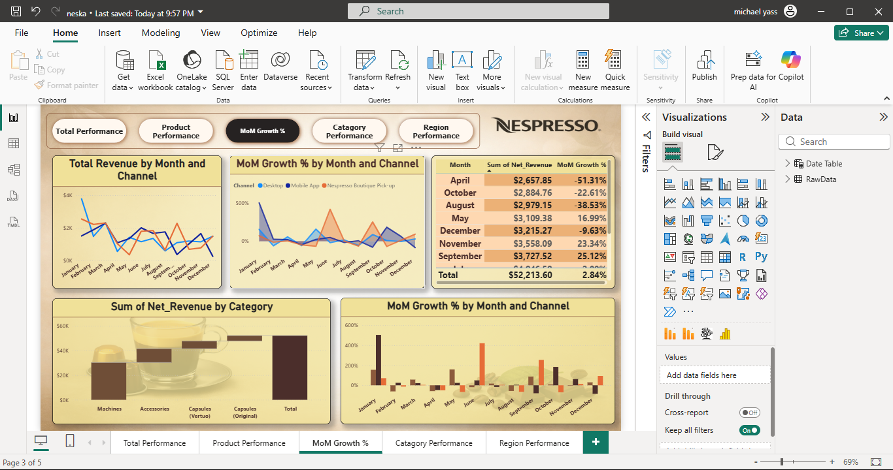
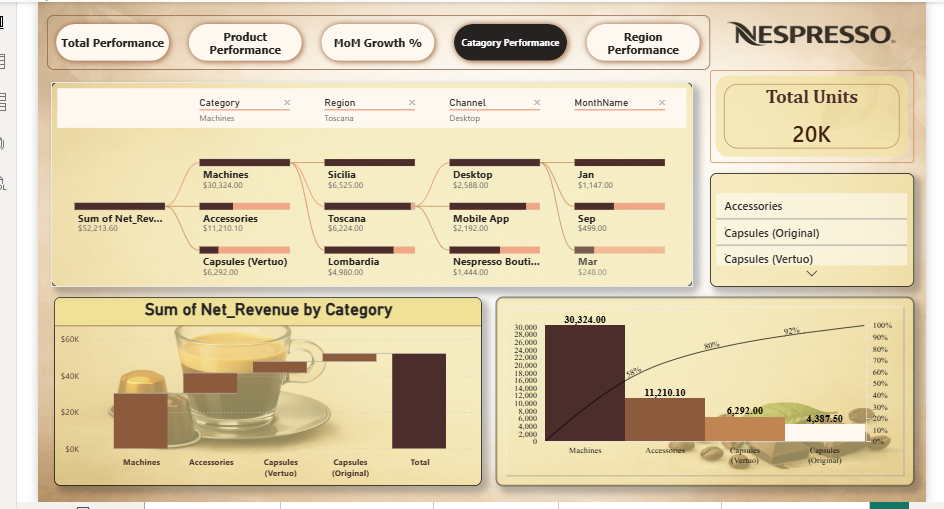
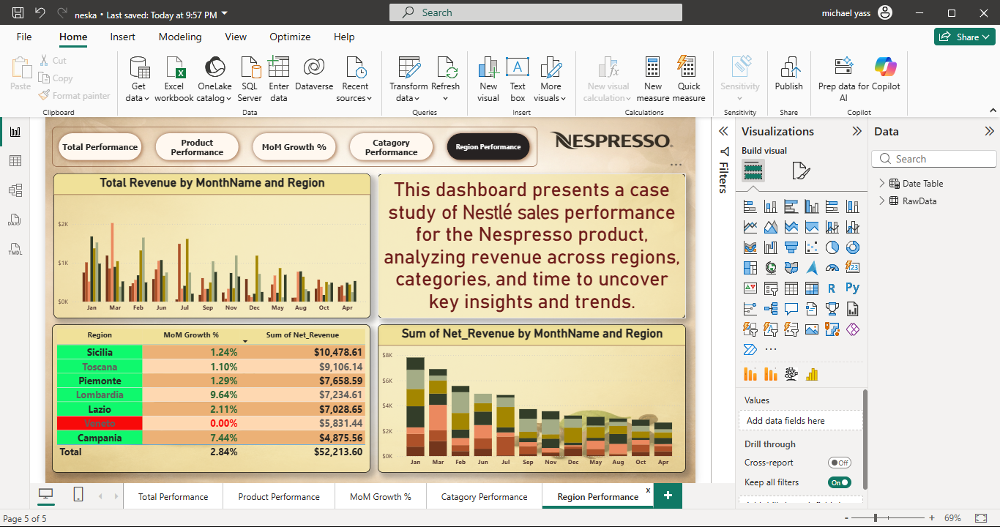

# Nespresso Sales Dashboard

A complete case study analyzing Nestlé Nespresso sales data using Power BI to track performance, analyze trends, and generate actionable insights.

---

## 🎥 Demo Video

---

## 📊 Total Performance

This page provides a high-level overview of business performance:

* Total Revenue: **$52,213**
* Total SKUs: **12**
* Machines contribute **58.08%** of total revenue
* Accessories: **21.47%**
* Capsules (Original + Vertuo): ~**32% combined**

It gives a quick understanding of overall performance and revenue distribution.

---

## 📦 Product Performance

This page focuses on product-level insights:

* Top 10 SKUs generate up to **~$10.6K**
* Clear ranking of best and worst performing products
* Helps identify high-performing SKUs and optimization opportunities

---

## 📈 MoM Growth

Monthly trend and growth analysis:

* Average MoM Growth: **2.84%**
* Notable drop in April: **-51.31%**
* Strong growth in September: **+25.12%**

This helps track seasonality and performance fluctuations.

---

## 🧩 Category Performance

Category-level comparison:

* Machines: **$30,324** (highest contributor)
* Accessories: **$11,210**
* Capsules (Vertuo): **$6,292**
* Capsules (Original): **$4,387**

Shows clear dominance of Machines category.

---

## 🌍 Region Performance

Regional performance breakdown:

* Sicilia: **$10,478** (top region)
* Toscana: **$9,106**
* Piemonte & Lombardia follow
* Noticeable variation across regions

Helps identify strong and weak markets.

---

## 🔍 Key Insights

* Business heavily relies on Machines category
* Revenue is concentrated in a few top-performing SKUs
* Monthly performance shows volatility
* Regional imbalance indicates growth opportunities

---

## 🛠 Tools Used

* Power BI

---

## 🚀 Goal

To deliver clear, data-driven insights that support better business decisions and performance optimization.
